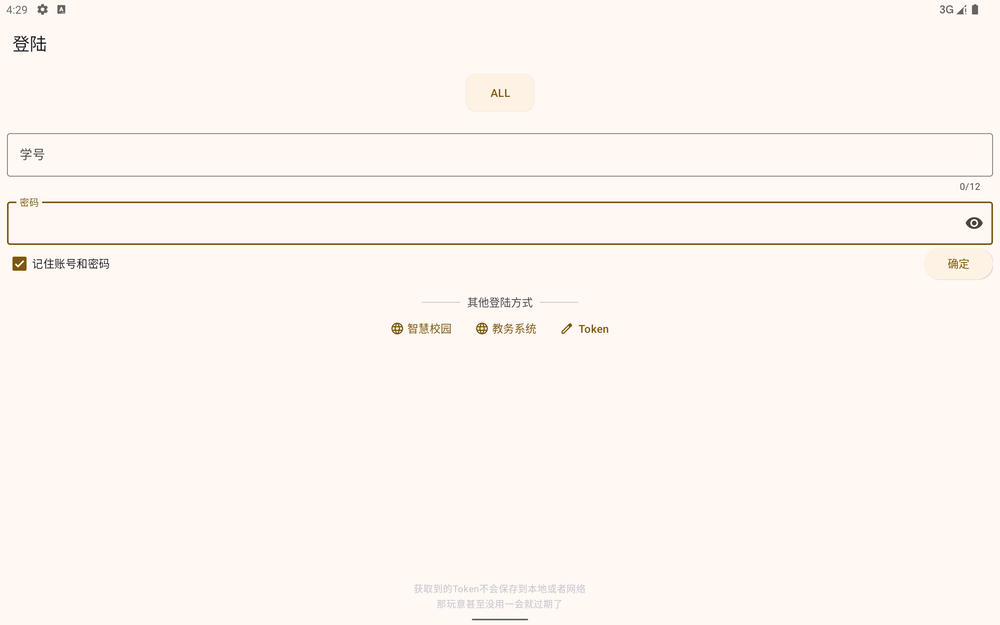
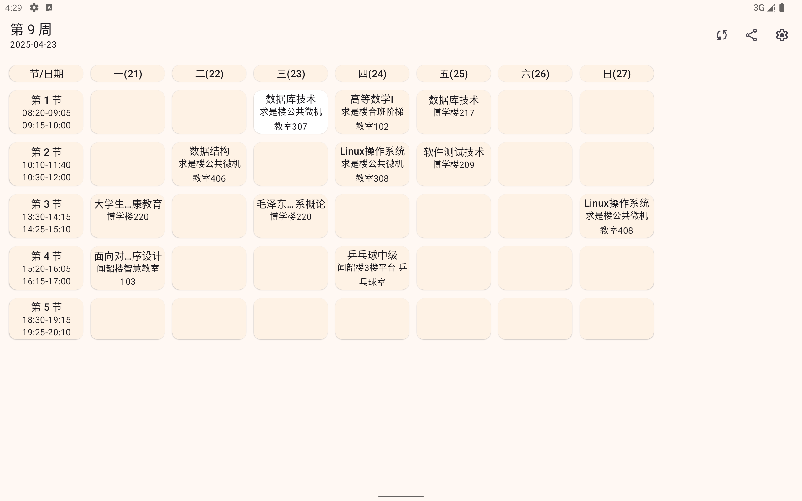
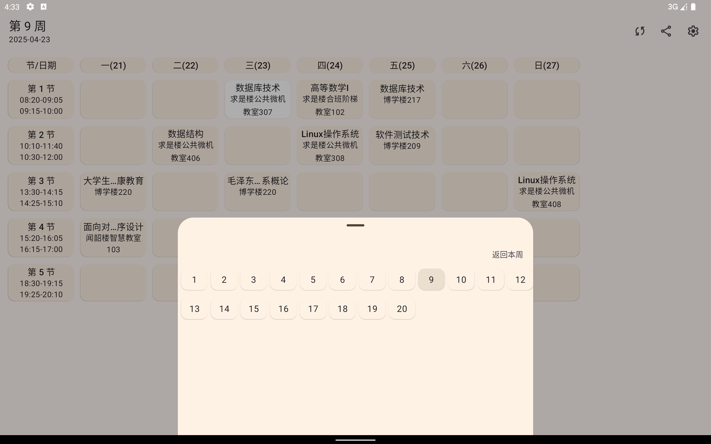
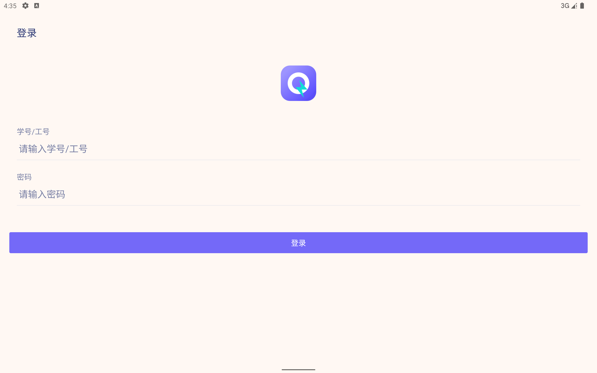

# 一柚表
### 一款教务管理系统制作的课程表，支持一键导入教务系统，支持登陆教务系统，离线课表，导入课表，导出课表，课表分享 
### 使用
#### 登陆
    账号密码登陆(输入教务系统设置的学号和密码点击确定按钮)
    智慧校园登陆(智慧校园任意登陆后找到办事大厅->教务系统/自动获取Token)
    教务系统登陆(输入学号和密码点击确定按钮/自动获取Token)

#### 导入导出课表

1. 支持动登陆位置导入[kczip](https://muqingcandy.top/KcList.kczip)
2. 支持.kczip压缩包打开软件导入
3. 支持从设置位置导出.kczip

### 截图(Pad)

<!--suppress CheckImageSize -->

### 后续的改进

1. 多端同步更新离线课表
2. 上课/签到提醒
3. 水课标记
4. 2D教室
## 贡献者✨
